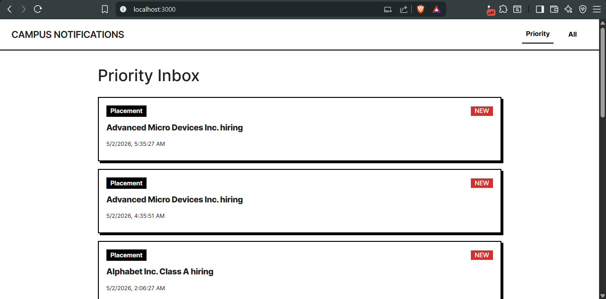
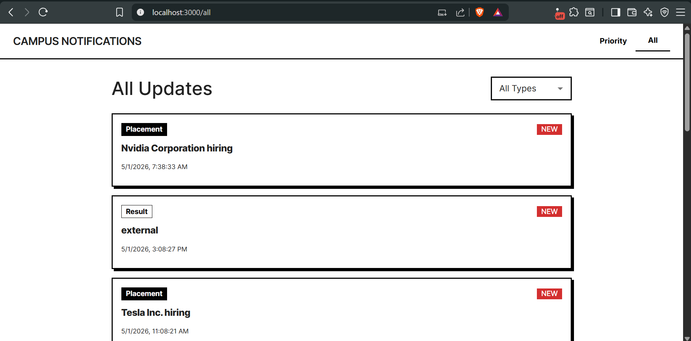
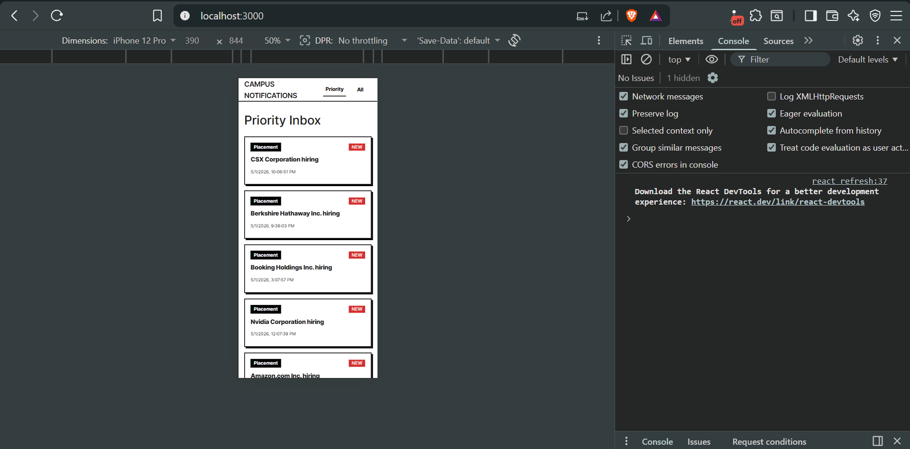
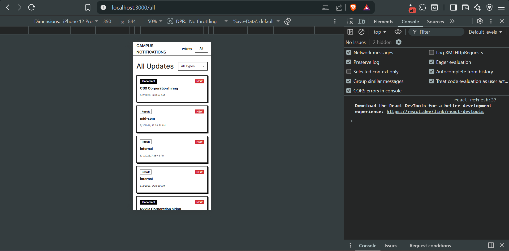

# Stage 1

## Priority Sorting Algorithm Approach
To determine the top 10 most important unread notifications, I implemented a multi-tiered sorting algorithm:

1. **Weight Assignment:** Each notification type is mapped to a numerical weight to establish an absolute hierarchy:
   - `Placement` = 3 (Highest Priority)
   - `Result` = 2
   - `Event` = 1 (Lowest Priority)

2. **Primary Sort (Weight):** The sorting function first compares the assigned weight of two notification objects. The item with the higher weight is placed first (Descending order).

3. **Secondary Sort (Recency):** If two notifications possess the exact same weight (e.g., both are "Placement" notifications), the algorithm defaults to a chronological sort. The ISO-formatted string is converted into a Unix timestamp (`getTime()`), and the more recent timestamp is placed first.

4. **Trimming:** Finally, `Array.prototype.slice(0, 10)` is utilized to extract only the top 10 items, creating the Priority Inbox.

## Maintaining the Top 10 Efficiently (Handling Incoming Data)
As new notifications arrive in real-time or via polling, running a full `O(N log N)` sort on the entire historical dataset for every single new notification is computationally expensive. 

To maintain the Top 10 efficiently, we treat the existing Top 10 list as a bounded Priority Queue (or a Min-Heap capped at size 10). 

**The approach for incoming notifications:**
1. When a new notification arrives, calculate its Priority Score (Weight + Timestamp).
2. Compare the new notification *only* against the 10th item (the lowest priority item) currently in the Top 10 Inbox.
3. If the new notification's priority is lower than the 10th item, it is immediately discarded from the Priority Inbox logic.
4. If the new notification's priority is higher, we pop the 10th item out of the array, insert the new notification using a binary search insertion `O(log N)` or simple insertion sort, and maintain exactly 10 items.

This reduces the time complexity of handling a new incoming notification from `O(N log N)` to essentially `O(1)` or `O(log K)` where K is the constant 10.

---

## Stage 2: Frontend Architecture & State Management

### 1. Client-Side State Management (Read/Unread Status)
Because the provided evaluation API does not include a mutation endpoint (POST/PUT/PATCH) to persist a user's "read" receipts on the server, the read/unread state is managed entirely on the client side.
*   **Implementation:** I utilized the browser's native `localStorage` API synced with a React custom hook (`useReadState`). 
*   **Workflow:** When a user clicks a notification card, its unique `ID` is appended to an array of "read" IDs stored in `localStorage`. 
*   **Benefit:** This ensures that the user's read history persists across browser refreshes and session restarts without requiring backend database modifications.

### 2. Pagination & Filtering Strategy
To handle large volumes of notifications efficiently, the "All Updates" view delegates the heavy lifting to the server via query parameters.
*   **API Integration:** The frontend maps local React state (`page` and `filter`) directly to the API's `page`, `limit`, and `notification_type` parameters.
*   **UX Consideration:** When a user changes the category filter (e.g., from "All" to "Placement"), the pagination state is intentionally reset to `page = 1`. This prevents edge cases where a user might be on Page 4 of "All", switch to "Event", and see an empty screen because there aren't 4 pages of Events.

### 3. Component Reusability & UI Architecture
To maintain a DRY (Don't Repeat Yourself) codebase, the UI was modularized:
*   **NotificationItem Component:** A single, reusable Material UI `<Card>` component is utilized across both the Priority Inbox and the All Notifications page. It accepts props for the notification data and its read status.
*   **Visual Hierarchy:** Read and unread states are distinguished using opacity shifts, background color changes, and conditional rendering of a high-contrast "NEW" badge to prioritize user attention.
*   **Routing:** `react-router-dom` is used for client-side routing, enabling seamless, instantaneous transitions between the Priority and All Updates views without full page reloads, preserving the application state.

# Campus Notifications - Frontend Evaluation

## Project Media

### Desktop Views
**Priority Inbox:**

**All Updates:**

---

### Mobile Views
**Priority Inbox:**

**All Updates:**
